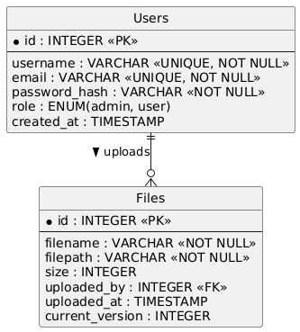

# File operations
This is a documentation for the module of file operations. \
Person responsible for the documentation of that module is Jakub Suliga.

## File storage
Files in the module are stored in a general directory for services in the system under the path:
`/srv/file-ops/data/`. \
To allow the program to save in that directory there is a need to:
- fistly create it
- add specific permission to the user running the server
```
sudo mkdir -p /srv/file-ops/data
sudo chown -R student:student /srv/file-ops
sudo chmod 750 /srv/file-ops /srv/file-ops/data
```
The files provided by users are stored in sepearate directories. The general path structure is:
```
user/<userID>/file/<fileId>/<safe_logical_name>
```

## File metadata
Metadata of files will be stored in database in the following table and with following realtionships:


## API endpoints
`GET /api/files`
List all files belonging to the authenticated user. There is possibility to search and sort the output.
Example:
```
curl -O -J http://localhost:8000/api/files
```
---
`GET /api/files/{file_id}/info`
List info about a file specified in a parameter.
Example:
```
curl -O -J http://localhost:8000/api/files/1/info
```
---
`GET /api/upload`
Upload a file to the specific directory for the current user.
Example:
```
curl -O -J http://localhost:8000/api/upload
```
`GET /api/download/{file_id}`
Downloads a file belonging to the authenticated user.
- Authorization: user must own the file or have shared access.
- Response: binary file stream.
- Logs: "download" action is written to log_book.
Example:
```
curl -O -J http://localhost:8000/api/download/15
```
---
`DELETE /api/delete/{file_id}`
Deletes the specified file both from storage and database.
- Authorization: only the file owner may delete.
Response:
```
curl -X DELETE http://localhost:8000/api/delete/15
```